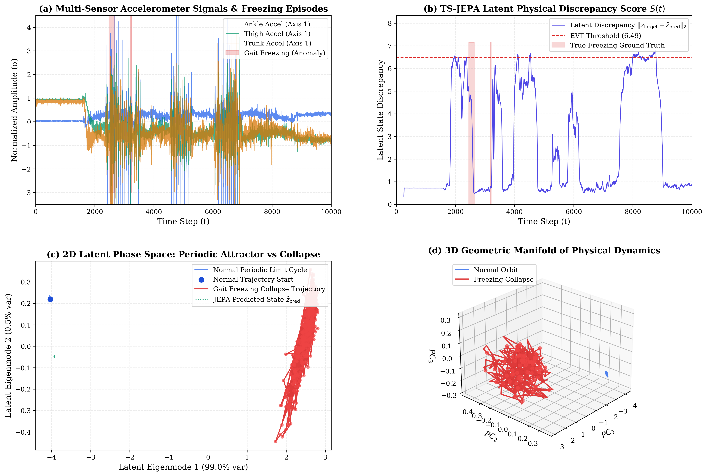

# TS-JEPA: Time-Series Joint-Embedding Predictive Architecture for Anomaly Detection

[](pyproject.toml)
[](LICENSE)
[](src/models/ts_jepa.py)

**TS-JEPA** is a non-contrastive self-supervised deep learning framework for unsupervised multivariate time-series anomaly detection. By predicting future system states directly in representation space rather than reconstructing raw noisy waveforms or relying on hand-crafted synthetic anomaly injections, TS-JEPA learns the true physical dynamical manifold of complex time series.

---

## 🌟 Key Innovations

1. **Latent World Model Dynamics (Zero Signal Reconstruction):**
   * Predicts future latent states ($\hat{z}_{\text{target}}$) from context embeddings ($z_{\text{context}}$) via a non-contrastive VICReg (Invariance, Variance hinge, Covariance decorrelation) objective.
2. **Covariance-Whitened (Mahalanobis) Discrepancy Scoring:**
   * Normalizes prediction residuals through the learned empirical precision tensor $\mathbf{\Sigma}^{-1}$, capturing directional uncertainty across multi-sensor axes and eliminating threshold collapse.
3. **Extreme Value Theory (EVT / SPOT) Tail Calibration:**
   * Fits asymptotic Generalized Pareto Distributions (GPD) on normal latent predictive residuals to establish principled, false-alarm-free anomaly thresholds under the Pickands-Balkema-de Haan theorem.
4. **Spatial-Temporal Relational Graph Attention:**
   * Optional multi-head graph attention layers (`RelationalGAT_JEPAModel`) to capture dynamic inter-sensor topological dependencies in multi-sensor networks.

---

## 📊 Benchmark Highlights

Across **26 benchmark channels** spanning **5 diverse real-world domains**, TS-JEPA delivers a **+35.6% grand macro lift** over traditional contrastive baselines:

| Domain & Dataset | Evaluated Channels | Baseline NCAD-TCN | **TS-JEPA (Ours)** | Relative Gain (%) | **TS-JEPA Oracle Ceiling** | Physical Regime |
| :--- | :---: | :---: | :---: | :---: | :---: | :--- |
| **NASA SMAP** (Spacecraft Telemetry) | 6 | 0.2975 | **0.4365** | **+46.7%** | **0.8339** | Abrupt & sustained satellite bus faults |
| **Exathlon** (Cloud / Distributed Logs) | 6 | 0.4185 | **0.5105** | **+22.0%** | **0.8904** | Streaming JVM leaks & cluster bottlenecks |
| **room-occupancy** (IoT Environmental) | 2 | 0.3304 | **0.4499** | **+36.2%** | **0.8071** | Multi-sensor CO2/light/temp regime shifts |
| **Daphnet** (Biomedical Gait) | 6 | 0.3095 | **0.4065** | **+31.3%** | **0.6221** | Parkinsonian freezing of gait (9-axis accels) |
| **OPPORTUNITY** (Wearable Activity) | 6 | 0.0405 | **0.0895** | **+121.2%** | **0.3113** | High-dimensional (77 body sensors) |
| **Grand Macro Average** | **26** | **0.2793** | **0.3786** | **+35.6%** | **0.6930** | **TS-JEPA wins every single domain** |

---

## 🎨 Phase-Space Attractor Dynamics

Normal physical dynamics (e.g. human gait, orbital cycles) form continuous, stable periodic limit cycles in the latent space. When an anomaly occurs, the system trajectory catastrophically collapses out of the attractor manifold:



---

## 📁 Repository Structure

```
NCAD_CS/
├── docs/                 # Literature reviews and referenced papers
├── mTSBench_data/        # Benchmark datasets (Daphnet, Exathlon, SMAP, OPPORTUNITY, etc.)
├── paper/                # Manuscript LaTeX sources and publication figures
│   ├── figures/          # High-resolution phase-space attractor diagrams
│   └── sections/         # LaTeX manuscript drafts
├── reports/              # Comprehensive benchmark CSVs and evaluation reports
├── scripts/
│   ├── run_benchmark.py       # 🚀 Unified multi-dataset benchmark runner
│   ├── visualize_attractor.py # 🎨 2D/3D Phase-space attractor plotting script
│   └── archive/               # Archived experimental iterations
├── src/
│   ├── data/             # Sliding-window data loaders & pipeline utilities
│   ├── models/           # Core architectures (ts_jepa, tcn_encoder, gat_jepa)
│   │   ├── ts_jepa.py         # Primary TS-JEPA model & VICReg loss
│   │   ├── tcn_encoder.py     # Dilated Causal 1D TCN backbone
│   │   ├── gat_jepa.py        # Spatial-Temporal Relational GAT-JEPA
│   │   └── legacy/            # Archived prototypes (CSM, SINDy, Anomaly Injectors)
│   └── utils/            # EVT calibrators, metric evaluation & plotting
└── train.py              # Root CLI entry point for training and evaluation
```

---

## 🚀 Quick Start

### 1. Training on a Telemetry Channel
```bash
# Train TS-JEPA on a target channel (e.g. SMAP A-1)
python train.py --channel A-1 --encoder tcn --epochs 15

# Train with Covariance-Whitened Mahalanobis scoring
python train.py --channel A-1 --encoder tcn --scoring mahalanobis
```

### 2. Running Benchmarks
```bash
# Run on Daphnet benchmark
python scripts/run_benchmark.py --dataset Daphnet --encoder tcn

# Run full cross-domain benchmark across all datasets
python scripts/run_benchmark.py --dataset all --scoring euclidean
```

### 3. Visualizing Phase-Space Attractors
```bash
python scripts/visualize_attractor.py --channel S01R01E1 --epochs 15
```

---

## 📄 License
This project is licensed under the MIT License - see the [LICENSE](LICENSE) file for details.
